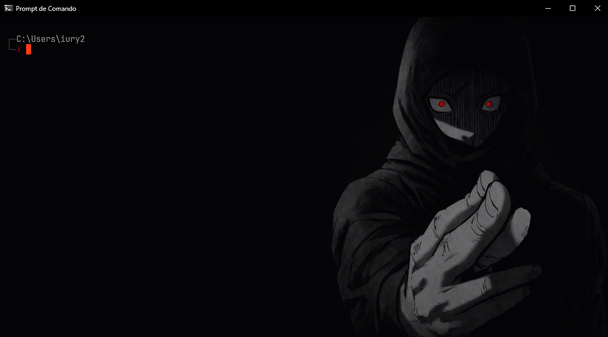

# Dark Terminal + Claude Code

Dark aesthetic theme for Windows Terminal + Claude Code. Red and gray monochrome palette.



## What it installs

- **Hellfire** color scheme — red + gray monochrome (Windows Terminal)
- **JetBrainsMono Nerd Font** — icons and glyphs support
- **Dark statusline** for Claude Code — model, context %, rate limits
- **Hellfire CMD prompt** — two-line with dark connectors and red `>`
- **CMD AutoRun** — clean startup (no Windows version banner) + custom prompt globally
- **jq** — required by the statusline

## Install

```
git clone https://github.com/horizonfps/dark-terminal
cd dark-terminal
install.bat
```

After installing, set Claude Code theme to `dark-ansi` (`/config` > theme) so it uses the Hellfire color scheme.

## Uninstall

```
uninstall.bat
```

Restores backups of your previous Windows Terminal settings and Claude Code statusline.

## Customization

### Background image

Add to Windows Terminal `settings.json` under `profiles.defaults`:
```json
"backgroundImage": "C:\\path\\to\\image.png",
"backgroundImageOpacity": 0.6,
"backgroundImageStretchMode": "uniformToFill"
```

### Per-profile background

Override for a specific profile (e.g., CMD) inside `profiles.list`:
```json
{
    "guid": "{0caa0dad-35be-5f56-a8ff-afceeeaa6101}",
    "backgroundImage": "C:\\path\\to\\other-image.png",
    "backgroundImageOpacity": 1
}
```

## Requirements

- Windows 10/11
- Windows Terminal
- Git Bash (for Claude Code statusline)
- Claude Code CLI (optional, for statusline)
